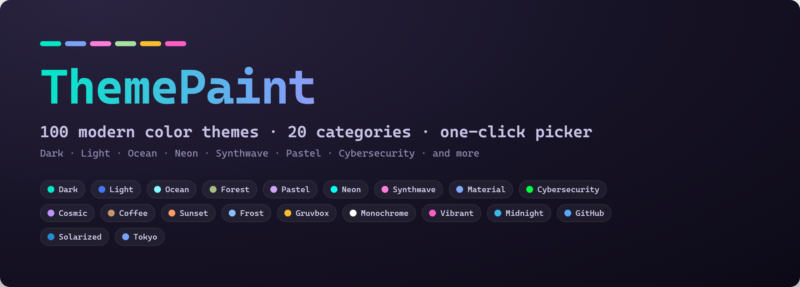
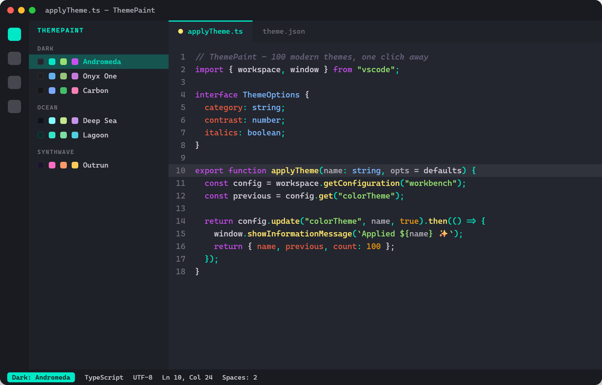
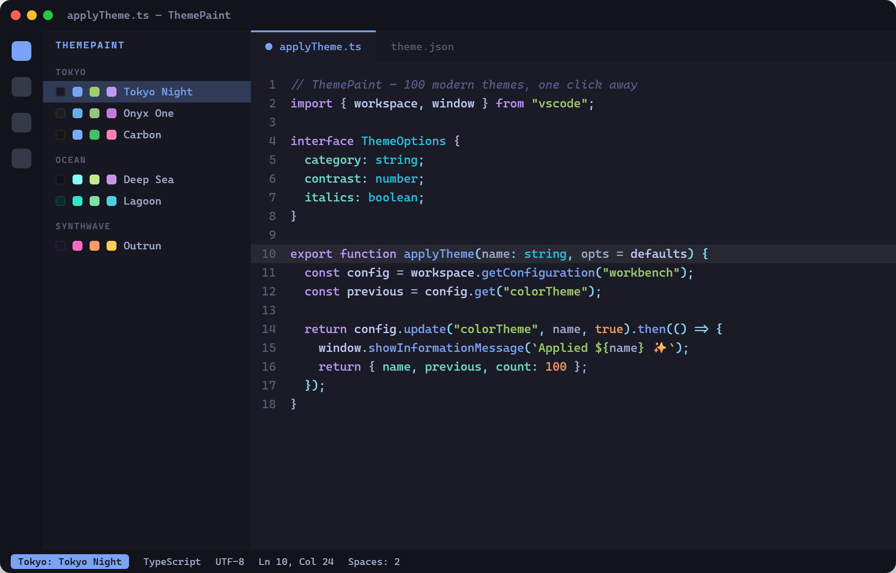
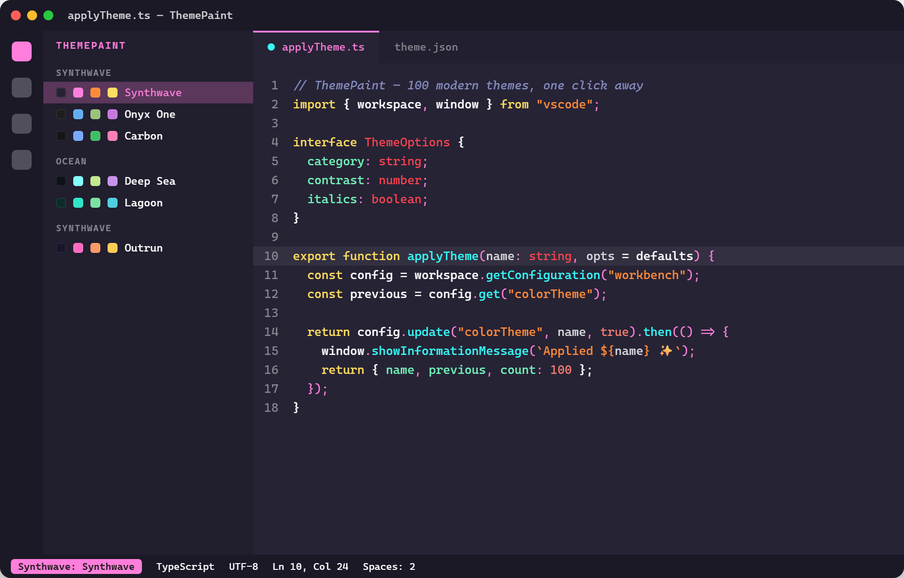
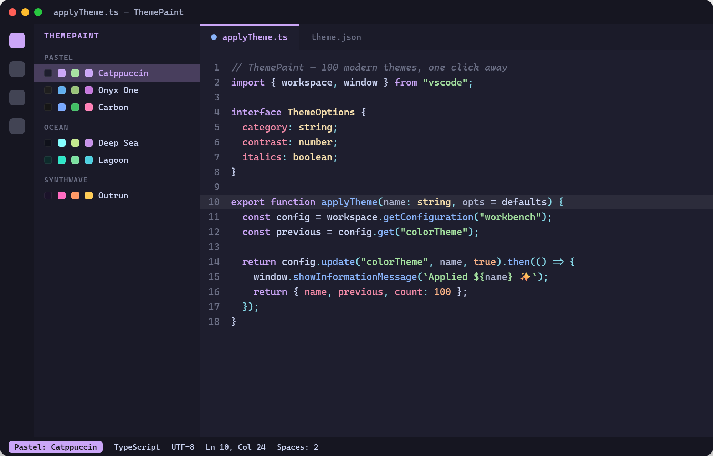
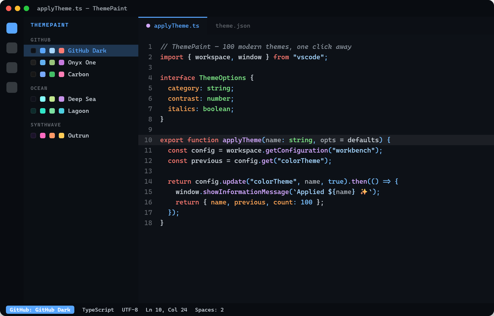
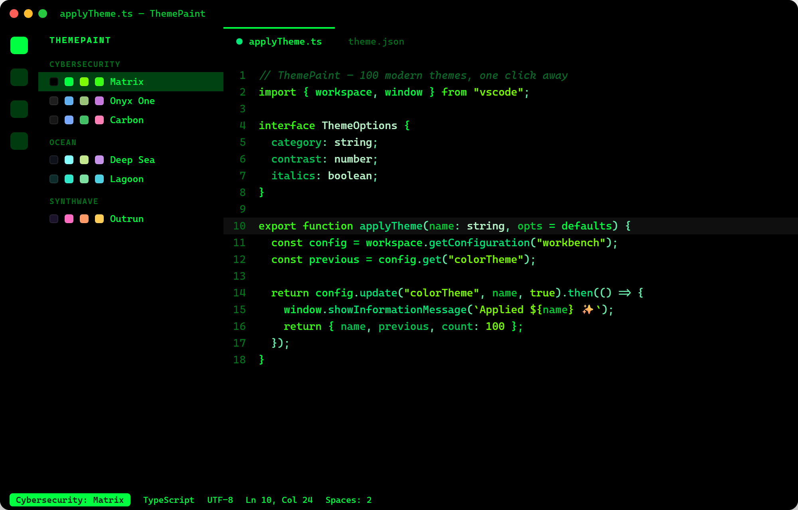

<p align="center">
  
</p>

<h1 align="center">ThemePaint</h1>

<p align="center"><b>100 modern color themes in 20 categories — with a one-click theme picker right in your sidebar.</b></p>

<p align="center">
  <a href="https://marketplace.visualstudio.com/items?itemName=ToqirAhmad.themepaint"></a>
  <a href="https://marketplace.visualstudio.com/items?itemName=ToqirAhmad.themepaint"></a>
  <a href="https://marketplace.visualstudio.com/items?itemName=ToqirAhmad.themepaint"></a>
  <a href="https://marketplace.visualstudio.com/items?itemName=ToqirAhmad.themepaint&ssr=false#review-details"></a>
  <a href="LICENSE"></a>
</p>

<p align="center">
  <b>One extension. A whole wardrobe of themes.</b><br/>
  Dark · Light · Ocean · Forest · Pastel · Neon · Synthwave · Material · Cybersecurity · Cosmic · Coffee · Sunset · Frost · Gruvbox · Monochrome · Vibrant · Midnight · GitHub · Solarized · Tokyo
</p>

---

## Table of Contents

- [Why ThemePaint](#why-themepaint)
- [Screenshots](#screenshots)
- [Installation](#installation)
- [Using the Theme Picker](#using-the-theme-picker)
- [All 20 Categories](#all-20-categories)
- [Color Palette Reference](#color-palette-reference)
- [FAQ](#faq)
- [Contributing & Development](#contributing--development)
- [License](#license)

---

## Why ThemePaint

Most theme extensions ship one look. ThemePaint ships **a hundred** — organized, previewable, and switchable without ever leaving your editor.

- 🎨 **100 hand-tuned themes** across **20 categories**, five themes each.
- ⚡ **One-click picker in the sidebar** — browse by category, see a live color swatch for every theme, and apply instantly.
- 🔍 **Searchable** — filter the whole library by name as you type.
- 🌈 **Readable syntax by design** — every theme uses a *distinct* color for keywords, strings, functions, numbers, types, variables, properties, and operators.
- 🧩 **Real VS Code themes** — they also appear in the native **Preferences: Color Theme** picker.
- ↩️ **Reversible** — a **Reset to my previous theme** button restores whatever you had before. Uninstall and your editor goes right back to normal; nothing is left behind.
- 🆓 **Free & open source**, MIT licensed.

---

## Screenshots

> A few highlights from the library. Every screenshot is a real render of the theme's actual palette.

### 🌌 Dark · Andromeda
A deep slate backdrop with a bright teal accent — the flagship dark look.

<p align="center"></p>

### 🏙️ Tokyo · Tokyo Night
Cool blues and soft violets, inspired by the city after dark.

<p align="center"></p>

### 🌆 Synthwave
Hot pink, cyan, and neon glow — retro-futuristic and unapologetically bold.

<p align="center"></p>

### 🍮 Pastel · Catppuccin
Soft, muted pastels that stay easy on the eyes for long sessions.

<p align="center"></p>

### 🐙 GitHub · GitHub Dark
The familiar GitHub palette, faithfully tuned for the editor.

<p align="center"></p>

### 🟩 Cybersecurity · Matrix
Pure black, phosphor green — for when you want to feel like you're in the mainframe.

<p align="center"></p>

---

## Installation

### Easy Installation

Get started in under a minute:

1. Open the **Extensions** sidebar in Visual Studio Code (`Ctrl+Shift+X` / `Cmd+Shift+X`).
2. Search for **ThemePaint**.
3. Click **Install**.
4. Click the **ThemePaint** icon in the Activity Bar (left edge) to open the picker.
5. Pick any theme — it's applied instantly.
6. Enjoy! And consider leaving a ⭐⭐⭐⭐⭐ review.

### Alternate Installation

Prefer the command palette?

1. Launch **Quick Open** — `Ctrl+P` (Windows/Linux) or `Cmd+P` (macOS).
2. Paste: `ext install ToqirAhmad.themepaint`
3. Hit **Enter**, then **Install**.

---

## Using the Theme Picker

<p align="center"></p>

- Click the **ThemePaint** icon in the Activity Bar to open the picker.
- Themes are **grouped by category**, each with a small **color preview**.
- **Click any theme to apply it** — the active one is checked.
- Use the **search box** to filter by name.
- **Reset to my previous theme** switches back to whatever theme you had before you first used ThemePaint.

You can also run **ThemePaint: Open Theme Picker** from the Command Palette (`Ctrl+Shift+P` / `Cmd+Shift+P`).

---

## All 20 Categories

20 categories, 5 themes each — 100 in total.

| Category | Themes |
| --- | --- |
| 🌑 **Dark** | Andromeda · Onyx One · Carbon · Obsidian · Eclipse |
| ☀️ **Light** | Clean · Paper · Daylight · Linen · Porcelain |
| 🌊 **Ocean** | Deep Sea · Tidewater · Abyss · Lagoon · Marine |
| 🌲 **Forest** | Everforest · Pine · Moss · Fern · Woodland |
| 🍮 **Pastel** | Catppuccin · Rosé · Cotton · Sorbet · Macaron |
| 💡 **Neon** | Neon City · Cyberpunk · Vaporwave · Laser · Electric |
| 🌆 **Synthwave** | Synthwave · Outrun · Miami · Retrowave · Sunset Drive |
| 🧱 **Material** | Ocean · Palenight · Darker · Deep Ocean · Lighter |
| 🛡️ **Cybersecurity** | Matrix · Red Team · Blue Team · Amber CRT · Hacker |
| 🌌 **Cosmic** | Nebula · Galaxy · Aurora · Cosmos · Stardust |
| ☕ **Coffee** | Espresso · Mocha · Latte · Cappuccino · Cacao |
| 🌇 **Sunset** | Dawn · Dusk · Ember · Sunrise · Twilight |
| ❄️ **Frost** | Arctic · Glacier · Nord · Snow · Frostbite |
| 🟫 **Gruvbox** | Gruvbox Dark · Gruvbox Light · Retro · Vintage · Sepia |
| ⚪ **Monochrome** | Mono Dark · Mono Light · Slate · Graphite · Ash |
| 🎨 **Vibrant** | Candy · Tropical · Fiesta · Prism · Rainbow |
| 🌃 **Midnight** | Midnight · Deep Space · Black Hole · Void · Ink |
| 🐙 **GitHub** | GitHub Dark · GitHub Light · GitHub Dimmed · GitHub Dark HC · GitHub Colorblind |
| 🔆 **Solarized** | Solarized Dark · Solarized Light · Muted · Sage · Sand |
| 🗼 **Tokyo** | Tokyo Night · Tokyo Storm · Tokyo Day · Tokyo Moon · Kanagawa |

---

## Color Palette Reference

Every theme is built from a compact, consistent palette — a background, an accent, and a distinct color for each token type. A few of the highlights:

### Dark · Andromeda

| Role | Color | Hex |
| --- | --- | --- |
| Background | 🟪 | `#23262E` |
| Accent | 🟩 | `#00E8C6` |
| Keywords | 🟪 | `#C74DED` |
| Strings | 🟩 | `#96E072` |
| Functions | 🟨 | `#FFE66D` |
| Types | 🟦 | `#7CB7FF` |
| Numbers | 🟧 | `#F39C12` |
| Comments | 🟪 | `#6C6783` |

### Tokyo · Tokyo Night

| Role | Color | Hex |
| --- | --- | --- |
| Background | 🟦 | `#1A1B26` |
| Accent | 🟦 | `#7AA2F7` |
| Keywords | 🟪 | `#BB9AF7` |
| Strings | 🟩 | `#9ECE6A` |
| Functions | 🟦 | `#7AA2F7` |
| Types | 🟦 | `#C0CAF5` |
| Numbers | 🟧 | `#FF9E64` |
| Comments | 🟦 | `#565F89` |

### Synthwave

| Role | Color | Hex |
| --- | --- | --- |
| Background | 🟪 | `#262335` |
| Accent | 🩷 | `#FF7EDB` |
| Keywords | 🟨 | `#FEDE5D` |
| Strings | 🟧 | `#FF8B39` |
| Functions | 🟦 | `#36F9F6` |
| Types | ⬜ | `#FFFFFF` |
| Numbers | 🟥 | `#FE4450` |
| Comments | 🟪 | `#848BBD` |

---

## FAQ

**Do the themes stay if I uninstall ThemePaint?**
No — and that's by design. ThemePaint applies standard VS Code themes. When you uninstall it, VS Code automatically falls back to its default theme. Use **Reset to my previous theme** any time to go back to what you had before.

**Will the themes show up in the normal theme picker too?**
Yes. They're regular color themes, so they also appear in **Preferences: Color Theme** (`Ctrl+K Ctrl+T`).

**Is there a light theme?**
Several. The **Light**, **GitHub**, **Solarized**, **Gruvbox**, **Tokyo**, **Material**, **Coffee**, **Frost**, and **Monochrome** categories all include light variants.

**Which theme is best for presentations or screencasts?**
High-contrast picks like **Cybersecurity: Matrix**, **Synthwave**, **Neon: Cyberpunk**, or **GitHub: GitHub Dark HC** read well on a projector.

**Can I request a theme or a category?**
Absolutely — open an issue on the [repository](https://github.com/TOQIR-AHMAD/ThemePaint).

---

## Contributing & Development

All 100 themes are generated from compact palettes, so adding or tweaking one is a one-line change:

```bash
npm install          # install dev dependencies
npm run themes       # regenerate all 100 theme JSON files
npm run previews     # regenerate the README preview mockups (HTML)
npm run previews:shoot   # render the mockups to PNG (needs Chrome/Edge)
npm run build        # bundle the extension
```

- Palettes live in [`scripts/generate-themes.js`](scripts/generate-themes.js) — edit a tuple and re-run `npm run themes`.
- README previews are generated by [`scripts/generate-previews.js`](scripts/generate-previews.js) and shot to PNG by [`scripts/shoot-previews.js`](scripts/shoot-previews.js).

Issues and pull requests are welcome at [github.com/TOQIR-AHMAD/ThemePaint](https://github.com/TOQIR-AHMAD/ThemePaint).

---

## License

[MIT](LICENSE) © Toqir Ahmad

<p align="center">Made with 🎨 — if ThemePaint brightens your editor, consider leaving a ⭐ review on the <a href="https://marketplace.visualstudio.com/items?itemName=ToqirAhmad.themepaint">Marketplace</a>.</p>
